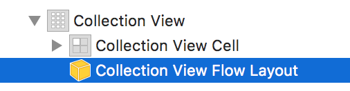
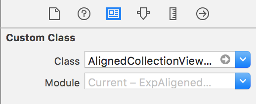

# AlignedCollectionViewFlowLayout
A collection view layout that aligns the cells left or right, just like left- or right-aligned text in a document.

## Usage

Add the file `AlignedCollectionViewFlowLayout.swift` to your Xcode project and you're ready to go:

### Setup in Interface Builder

1. You have a collection view in Interface Builder and setup its data source appropriately. Run the app and make sure everything works as expected (except the cell alignment).

2. In the Document Outline, select the collection view layout object.

3. In the Identity Inspector, set the layout object's custom class to `AlignedCollectionViewFlowLayout`.

4. Run your app. Your cells will now be left-aligned.

5. _(Optional)_ If you want your cells to be **right-aligned** just add the following code to your view controller's `viewDidLoad()` method:

        let flowLayout = collectionView?.collectionViewLayout as? AlignedCollectionViewFlowLayout
        flowLayout?.cellAlignment = .right

### Setup in code

1. Create a new `AlignedCollectionViewFlowLayout` object and specify the alignment you want (`.left` or `.right`):

        let alignedFlowLayout = AlignedCollectionViewFlowLayout(cellAlignment: .left)
        
2. Either create a new collection view object and and initialize it with `alignedFlowLayout`:

        let collectionView = UICollectionView(frame: bounds, collectionViewLayout: flowLayout)
     
   or assign `alignedFlowLayout` to the `collectionViewLayout` property of an existing collection view:
   
        yourExistingCollectionView.collectionViewLayout = alignedFlowLayout
        
3. Implement your collection view's data source.

4. Run the app.

### Enjoy! 😎
